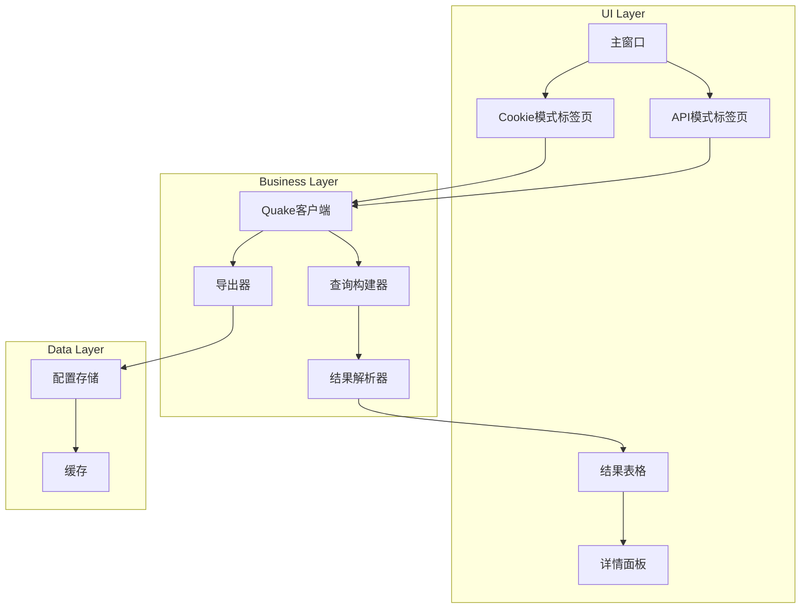

# Quake GUI Tool - Technical Design

Feature Name: quake-gui-tool
Updated: 2026-03-12

## Description

基于Go语言的跨平台GUI工具，用于调用360 Quake资产测绘平台。提供两种查询模式：Cookie模式和API模式，支持查询、浏览、导出等功能。

## Architecture



## Components and Interfaces

### 1. MainWindow

主窗口组件，管理整个应用的UI布局。

```go
type MainWindow struct {
    theme    *THEMENAME
    tabs     *widget.TabContainer
    cookie   *CookiePanel
    api      *ApiPanel
}
```

### 2. CookiePanel

Cookie模式界面面板。

```go
type CookiePanel struct {
    cookieInput *widget.Editor
    queryInput  *widget.Editor
    resultTable *widget.Table
    searchBtn   *widget.Button
    exportBtn   *widget.Button
}
```

### 3. ApiPanel

API模式界面面板。

```go
type ApiPanel struct {
    apiUrlInput  *widget.Editor
    apiKeyInput  *widget.Editor
    queryInput   *widget.Editor
    resultTable  *widget.Table
    searchBtn    *widget.Button
    exportBtn    *widget.Button
}
```

### 4. QuakeClient

Quake API客户端。

```go
type QuakeClient struct {
    baseURL   string
    apiKey    string
    cookie    string
    httpClient *http.Client
}

func (c *QuakeClient) Search(query string, page, pageSize int) (*SearchResult, error)
func (c *QuakeClient) TestConnection() error
func (c *QuakeClient) GetAssetDetail(id string) (*AssetDetail, error)
```

### 5. Exporter

结果导出器。

```go
type Exporter interface {
    ExportCSV(results []Asset, filename string) error
    ExportJSON(results []Asset, filename string) error
    ExportExcel(results []Asset, filename string) error
}
```

## Data Models

### SearchResult

```go
type SearchResult struct {
    Total    int     `json:"total"`
    Page     int     `json:"page"`
    PageSize int     `json:"page_size"`
    Data     []Asset `json:"data"`
}
```

### Asset

```go
type Asset struct {
    IP        string `json:"ip"`
    Port      int    `json:"port"`
    Protocol  string `json:"protocol"`
    Title     string `json:"title"`
    Banner    string `json:"banner"`
    Country   string `json:"country"`
    City      string `json:"city"`
    ASN       string `json:"asn"`
    Org       string `json:"org"`
    UpdatedAt string `json:"updated_at"`
}
```

### Config

```go
type Config struct {
    APIUrl  string `json:"api_url"`
    APIKey  string `json:"api_key"`
    LastDir string `json:"last_dir"`
}
```

## API Endpoints

根据Quake 3.0 API规范：

| Method | Endpoint | Description |
|--------|----------|-------------|
| POST | /api/v3/search | 执行搜索查询 |
| GET | /api/v3/search/{task_id} | 获取搜索结果 |
| GET | /api/v3/assets/{id} | 获取资产详情 |
| GET | /api/v3/me | 测试API连接 |

## Error Handling

| Error Code | Description | User Message |
|------------|-------------|---------------|
| 401 | 无效Cookie/API Key | "认证失败，请检查Cookie或API Key" |
| 403 | 权限不足 | "权限不足，无法访问该资源" |
| 429 | 请求过于频繁 | "请求过于频繁，请稍后重试" |
| 500 | 服务器错误 | "服务器错误，请稍后重试" |
| timeout | 网络超时 | "网络超时，请检查网络连接" |

## Test Strategy

### 单元测试

- 测试QuakeClient的各个方法
- 测试结果解析器
- 测试导出器

### UI测试

- 测试各个组件的交互
- 测试窗口事件

### 集成测试

- 测试完整的查询流程
- 测试导出功能
